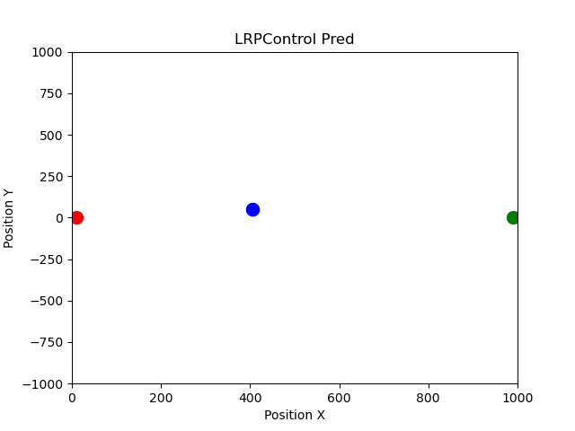

## **線形回帰-比例制御(LRPControl)**

### **特徴**
* 強化学習を使用しない制御はどうでしょうか...。
* この研究は，特に意味はありません．趣味で試してみた程度です．
* 制御の模倣には，利用できるかもしれません．

### **損失関数**
* 損失関数は以下のように定義した．

    $L(v',v)=MSE(v',v)$

* $v'$は，モデルから予測した速度である．
* $v$は，時刻速度の正解データである．

### **回帰モデル**
* 回帰モデルは線形回帰モデルを使用した．

    $ error=\sqrt{0.5\sum{(p_{g,i} - p_{c.i})^2} } $

    $ v'= model(error) $

### **デモ**

### **感想**
* あまり，良い手法だとは思えない．
* しかし，本質はerrorが小さくなるほど，速度も小さくするというのが本質で，当たり前だけど，線形回帰すれば，とりあえず解ける．